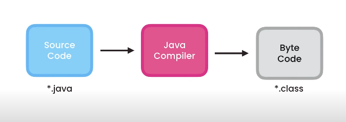
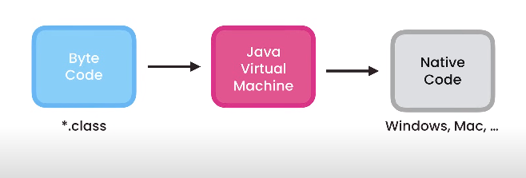

# java-basics

1. The **`Java Development Kit (JDK)`** is a **set of software tools** that developers use to develop
Java applications.
2. A JDK typically consists of

    - `Java Compiler` : **Converts java source code (.java files)** into **bytecode (.class files)** **that can be executed on the 
      Java Virtual Machine**
    - `Java Runtime Environment (JRE)` : **Provides the libraries, class files, and other resources** necessary **for running Java applications.**
    - `Java Development Tools (debugger/profiler)`
    - `Java API Documentation`
   

3. **Every Java program should have at least one function called** `main`.
4. Whenever we execute a Java Program, the `main` **function gets called** and the code inside this function gets executed.
5. **Functions don't exist on their own**, they should always belong to a `class`.
6. **Every Java program should have at least one class that contains the main function which is the `Main` Class**
7. A `method` is a **function that is a part of a class.**
8. **All the classes and methods should have an `access modifier.`** 
9. Classes Naming -> PascalNamingConvention
10. Methods Naming -> camelNamingConvention
11. We use **`package` to group related classes.**
12. All **Java files** should have the **`.java` extension**

## Java Program Execution

### 1. Compilation

In this step, IntelliJ uses the **`Java Compiler`** available in the `JDK`, 
**to compile our code in a different format called Java Byte Code**

1. To compile a **.java file manually** **`javac <file-name>` , eg `javac Main.java`**
2. This creates a **`Main.class` file.**
3. The **Java Byte Code** that we have in `Main.class` is **platform independent.**
4. Java Byte Code **can run on any os (windows,mac,linux etc) which has a JRE.**

### 2. Execution

`JVM` in `JRE` **takes our Java Byte Code and translates it to native code for the underliying OS.**
1. **To invoke JVM or execute a .class byte code manually**, step up two levels and **run `java <file-path-to-class>`  ,eg: `java com.basics.Main`.**
   - `Main` in `java com.basics.Main` is for **Main.class**

- This architecture is the reason why java applications are **portable** or **platform independent.**
- Using this architecture **we can write a java program on a Windows machine** and **execute it on Linux,Mac etc. or any OS which has `JRE`.**
- `C#` and `Python` also **have the same architecture** and are **hence platform independent as well.**

